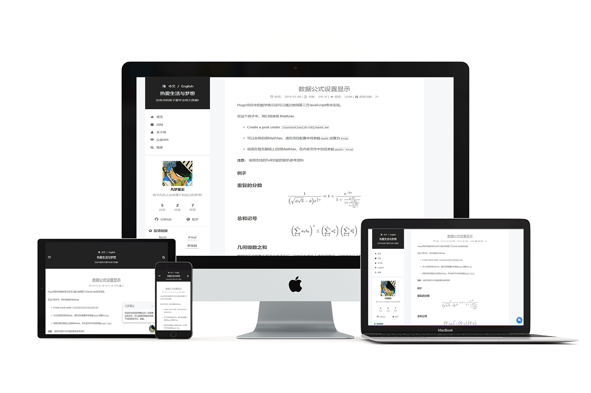

[](https://travis-ci.com/elkan1788/hugo-theme-next)


# NexT For Hugo

Hugo版本的NexT主题，移植于[NexT](https://github.com/iissnan/hexo-theme-next).

## 描述

NexT 是个简洁和动感十足的主题. 我把它从Hexo引擎移植到了[Hugo](https://gohugo.io/) ，同时也使用此主题搭建个人博客站点。

> 感谢[xtfly](https://github.com/xtfly)的分享, 我在他的基础上面做了很多的个性化与以及加强. 

## 在线预览: 

[https://lisenhui.cn](https://lisenhui.cn)



## 用法

1. 下载主题: `git clone git@github.com:elkan1788/hugo-theme-next.git next`

2. 拷贝 `next` 目录到您博客站点的 `themes` 目录下

3. 拷贝主题目录中的 `exampleSite\config` 到您的博客站点根目录下, 同时修改对应的实际参数值

4. 在content目录下创建Markdown文件，用来发表您的博文。可以参考主题目录中的 `exampleSite\content` 目录结构和内容
> 可直接拷贝此目录到您的站点目录下

5. 在终端中输入 `hugo server --noHTTPCache` 命令启动站点

6. 打开浏览器，访问：http://localhost:1313/

## 注意事项

- 由于Hugo引擎与Hexo引擎存在差异，所以**部分Hexo引擎的样式还不支持**，后续会不断的优化和完善

- 这个主题只在我的博客上测试过,也许它不适合您的需求，可以根据您的偏好对它进行定制

- Hugo测试版本: 0.74.2+

- 如果有任何问题，可以在仓库中创建issues

## 写文章注意事项

1. 文章的开头模板:

    ```
    ---
    title: "Hello World"
    url: 2020/09/11/hexo-hello-world.html
    date: "2020-09-11"
    tags: 
      - 测试
      - 学习
    categories:
      - Hugo
    toc: true
    ---
    ```

1. 在文章中使用 `<!--more-->` 标签手动干预文章总结部分显示内容。 [manual summary splitting](https://gohugo.io/content-management/summaries/#user-defined-manual-summary-splitting) .


## 代办事项

- [x] 侧边栏的菜单
- [x] 侧边栏的友情链接
- [x] 文章导航目录显示
- [x] 支持多语言
- [x] 本地搜索
- [x] 语法高亮 (感谢[xulz](https://github.com/xtfly/hugo-theme-next/pull/6))
- [x] 支持 Latex 
- [x] 美化本地搜索样式
- [x] 新增 Valine 和 LiveRe 评论组件
- [x] 新增文章阅读次数
- [x] 新增公益404页面
- [x] 新增像百度, 谷歌, CNZZ等不同的站点统计
- [x] 创新个性化的自我介绍页面
- [x] 修改JS脚本和CSS样式，使用在线引入

## 许可
[MIT License](LICENSE).